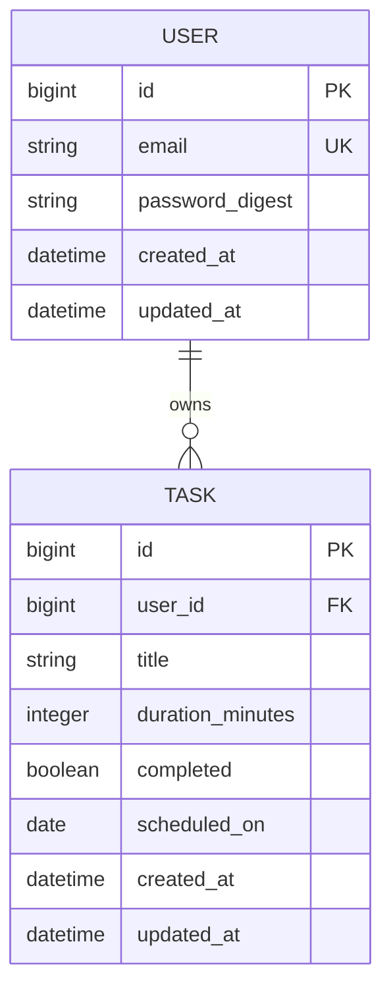

# Mini Task APP 仕様書

## 目的
このアプリは、部屋の片付けが苦手な人が、片付ける場所を小さなTaskに分け、
今日やることを決めて15分単位で取り組めるようにするアプリケーションです。

## 今回作らないもの
- 継続的な利用を促すためのゲーミフィケーション要素

## ユーザーストーリー
1. 片付けが苦手な利用者として、片付ける場所をタスクとして登録したい。
   なぜなら、何から始めればよいかを明確にしたいから。
2. 片付けが苦手な利用者として、1つのタスクを15分だけ実行したい。
   なぜなら、長時間の作業は集中力が続かないから。
3. 片付けが苦手な利用者として、終わったタスクを完了状態にしたい。
   なぜなら、達成感が次のモチベーションにつながるから。
4. 片付けが苦手な利用者として、アプリを起動したら、今日やるべきタスク一覧を見たい。
   なぜなら、何から始めればよいかを明確にしたいから。何から片付ければいいのか考えるのが面倒だから。
   
# 将来追加したい機能
- 部屋の画像をAIが確認して、片付ける順番を提案してタスクリストに追加してくれる

# データ設計

## User

| 項目名 | 型 | 制約 | 目的 |
|---|---|---|---|
| id | bigint | PK | Userを区別する |
| email | string | NOT NULL・UNIQUE | ログインに使う |
| password_digest | string | NOT NULL | ハッシュ化されたパスワードを保存する |
| created_at | datetime | NOT NULL | 作成日時を記録する |
| updated_at | datetime | NOT NULL | 更新日時を記録する |

## Task

| 項目名 | 型 | 制約 | 目的 |
|---|---|---|---|
| id | bigint | PK | Taskを区別する |
| user_id | bigint | FK・NOT NULL | 所有者のUserと結び付ける |
| title | string | NOT NULL | 片付ける場所や内容を保存する |
| duration_minutes | integer | NOT NULL・初期値15 | 作業時間を保存する |
| completed | boolean | NOT NULL・初期値false | 完了・未完了を保存する |
| scheduled_on | date | NOT NULL | Taskを実行する予定日を保存する |
| created_at | datetime | NOT NULL | 作成日時を記録する |
| updated_at | datetime | NOT NULL | 更新日時を記録する |

## ER図

## アプリケーションのルール

- 1人のUserは0個以上のTaskを持てる。
- 1つのTaskは必ず1人のUserに所属する。
- ログイン中のUserが所有するTaskだけを表示する。
- 今日の一覧には、scheduled_onが今日のTaskだけを表示する。
- チェックボックスを操作するとcompletedが更新される。
- duration_minutesの初期値は15分とする。

# API設計

| 操作 | 目的 | HTTPメソッド | URL | 送るデータ | 成功 | 主な失敗 |
|---|---|---|---|---|---|---|
| Task一覧 | タスク一覧を表示する | GET | /tasks | Query: scheduled_on（任意）／Body: なし | 200 OK | 401 Unauthorized |
| Task詳細 | タスク詳細を表示する | GET | /tasks/:id | Path: id／Body: なし | 200 OK | 401 Unauthorized・404 Not Found |
| Task作成 | タスクを新しく作成する | POST | /tasks | Body: title, duration_minutes, scheduled_on | 201 Created | 401 Unauthorized・422 Unprocessable Content |
| Task更新 | タスクを更新する | PATCH | /tasks/:id | Path: id／Body: 変更したい title, duration_minutes, scheduled_on, completed | 200 OK | 401 Unauthorized・404 Not Found・422 Unprocessable Content |
| Task削除 | タスクを削除する | DELETE | /tasks/:id | Path: id／Body: なし | 204 No Content | 401 Unauthorized・404 Not Found |

